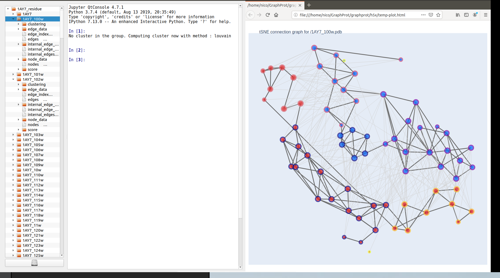

# DeepRank-GNN


[](https://github.com/DeepRank/DeepRank-GNN/actions)
[](https://app.codacy.com/gh/DeepRank/DeepRank-GNN?utm_source=github.com&utm_medium=referral&utm_content=DeepRank/DeepRank-GNN&utm_campaign=Badge_Grade)
[](https://coveralls.io/github/DeepRank/Deeprank-GNN?branch=master)


## Installation

You'll probably need to manually install pytorch geometric
  * pytorch_geometric : https://github.com/rusty1s/pytorch_geometric

When all the dependencies are installed just clone the repo and install it with:

```
pip install -e ./
```

The documentation can be found here : https://deeprank-gnn.readthedocs.io/ 

## Generate Graphs

All the graphs/line graphs of all the pdb/pssm stored in `data/pdb/` and `data/pssm/` with the `GenGraph.py` script. This will generate the hdf5 file `graph_residue.hdf5` which contains the graph of the different conformations.


```python
from GraphGen import GraphHDF5

pdb_path = './data/pdb'
pssm_path = './data/pssm'
ref = './data/ref'

GraphHDF5(pdb_path=pdb_path,ref_path=ref,pssm_path=pssm_path,
	      graph_type='residue',outfile='graph_residue.hdf5')
```

## Graph Interaction Network

Using the graph interaction network is rather simple :


```python
from deeprank_gnn.NeuralNet import NeuralNet
from deeprank_gnn.ginet import GINet

database = './hdf5/1ACB_residue.hdf5'

NN = NeuralNet(database, GINet,
               node_feature=['type', 'polarity', 'bsa',
                             'depth', 'hse', 'ic', 'pssm'],
               edge_feature=['dist'],
               target='irmsd',
               index=range(400),
               batch_size=64,
               percent=[0.8, 0.2])

NN.train(nepoch=250, validate=False)
NN.plot_scatter()
```

## Custom CNN

It is also possible to define new network architecture and to specify the loss and optimizer to be used during the training.

```python


def normalized_cut_2d(edge_index, pos):
    row, col = edge_index
    edge_attr = torch.norm(pos[row] - pos[col], p=2, dim=1)
    return normalized_cut(edge_index, edge_attr, num_nodes=pos.size(0))


class CustomNet(torch.nn.Module):
    def __init__(self):
        super(Net, self).__init__()
        self.conv1 = SplineConv(d.num_features, 32, dim=2, kernel_size=5)
        self.conv2 = SplineConv(32, 64, dim=2, kernel_size=5)
        self.fc1 = torch.nn.Linear(64, 128)
        self.fc2 = torch.nn.Linear(128, 1)

    def forward(self, data):
        data.x = F.elu(self.conv1(data.x, data.edge_index, data.edge_attr))
        weight = normalized_cut_2d(data.edge_index, data.pos)
        cluster = graclus(data.edge_index, weight)
        data = max_pool(cluster, data)

        data.x = F.elu(self.conv2(data.x, data.edge_index, data.edge_attr))
        weight = normalized_cut_2d(data.edge_index, data.pos)
        cluster = graclus(data.edge_index, weight)
        x, batch = max_pool_x(cluster, data.x, data.batch)

        x = scatter_mean(x, batch, dim=0)
        x = F.elu(self.fc1(x))
        x = F.dropout(x, training=self.training)
        return F.log_softmax(self.fc2(x), dim=1)


device = torch.device('cuda' if torch.cuda.is_available() else 'cpu')
model = NeuralNet(database, CustomNet,
               node_feature=['type', 'polarity', 'bsa',
                             'depth', 'hse', 'ic', 'pssm'],
               edge_feature=['dist'],
               target='irmsd',
               index=range(400),
               batch_size=64,
               percent=[0.8, 0.2])
model.optimizer = torch.optim.Adam(model.parameters(), lr=0.01)
model.loss = MSELoss()

model.train(nepoch=50)

```

## h5x support

After installing  `h5xplorer`  (https://github.com/DeepRank/h5xplorer), you can execute the python file `deeprank_gnn/h5x/h5x.py` to explorer the connection graph used by DeepRank-GNN. The context menu (right click on the name of the structure) allows to automatically plot the graphs using `plotly` as shown below.


