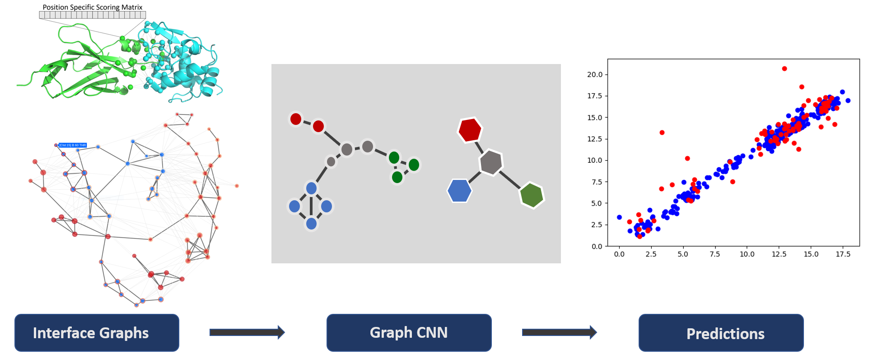

Overview
=========================

DeepRank-GNN is a framework that converts PPI interfaces into graphs and uses those to learn interaction patterns using Graph Neural Networks.

The framework is designed to be adapted to any PPI related research project.

Deeprank-GNN works in a two step process:

1) Graph generation 
-------------------------

Use your own protein-protein complexes to generate PPI interface graphs.

Go to :ref:`Creating Graphs<Creating Graphs>` 

2) Model Training
-------------------------

Tune and train your Graph Neural Network and make your own predictions.

Go to :ref:`Training a module<Training a module>` 
 

Motivations
=========================

Protein-protein interactions (PPIs) are essential in all cellular processes of living organisms
including cell growth, structure, communication, protection and death. Acquiring knowledge on PPI is
fundamental to understand normal and altered physiological processes and propose solutions to
restore them. In the past decades, a large number of PPI structures have been solved by experimental
approaches (e.g., X-ray crystallography, nuclear magnetic resonance, cryogenic electron microscopy).
Given the remarkable success of Convolutional Neural Network (CNN) in retrieving patterns in images [1]_,
CNN architectures have been developed to learn interaction patterns in PPI interfaces [2]_, [3]_.

CNNs however come with major limitations: First, they are sensitive to the input PPI
orientation, which may require data augmentation (i.e. multiple rotations of the input data) for the
network to forget about the orientation in the learning process; second, the size of the 3D grid is
unique for all input data, which does not reflect the variety in interface sizes observed in experimental
structures and may be problematic for large interfaces that do not fit inside the predefined grid size.
A solution to this problem is to use instead Graph Neural networks (GNN). 
By definition, graphs are non-structured geometric structures and do not hold orientation information. They are rotational invariant and can easily represent interfaces of varying sizes. 

Building up on our previous tool DeepRank(https://github.com/DeepRank/deeprank) that maps atomic and residue-level features from PPIs to 3D grids and applies 3D CNNs to learn problem-specific interaction patterns, we present here Deeprank-GNN. Deeprank-GNN converts PPI interfaces into graphs and uses those to learn interaction patterns. 

DeepRank-GNN is a framework than can be easily used by the community and adapted to any topic involving 
PPI interactions. The framework allows users to define their own graph neural network, features and target values. 

.. [1] Krizhevsky A, Sutskever I, Hinton GE, ImageNet classification with deep convolutional neural networks. Adv Neural Inf Process Syst 25, 2012

.. [2] Renaud N, Geng C, Georgievska S, Ambrosetti F, Ridder L, Marzella D, Bonvin A, Xue L, DeepRank: A deep learning framework for data mining 3D protein-protein interfaces, bioRxiv, 2021.01.29.425727

.. [3] Wang X, Terashi G, Christoffer CW, Zhu M, Kihara D. Protein docking model evaluation by 3D deep convolutional neural networks. Bioinformatics. 2020 ;36(7):2113-2118.
          
